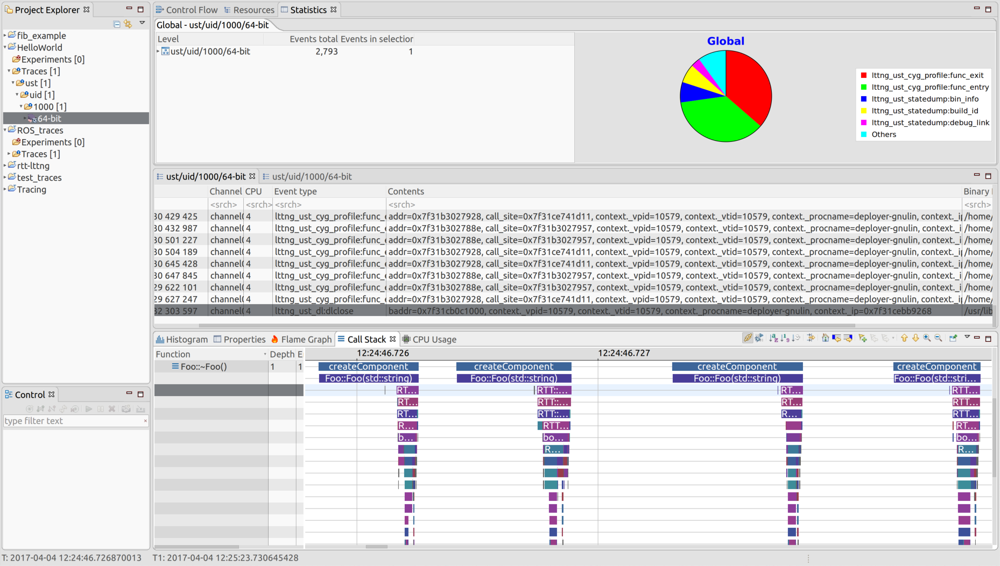

# Orocos Performance Analysis using LTTng

Introduction
------------
This repository will explain the steps to tracing Orocos components using LTTng and visualizing those traces using Trace Compass. 

Steps
-----

Install Orocos and LTTng

Tracing Procedure

1. Compile with debug flags:
orocreate-pkg name component
mkdir build; cd build
	#Compile on command line or add to CMakeLists: set(DCMAKE_CXX_FLAGS "-g -finstrument-functions ${CMAKE_CXX_FLAGS}")
cmake .. -DCMAKE_INSTALL_PREFIX=$(pwd)/../../install -DCMAKE_CXX_FLAGS="-g -finstrument-functions"
make install
cd ..
export RTT_COMPONENT_PATH=$(pwd)/../install/lib/orocos:$RTT_COMPONENT_PATH

2. Start LTTng tracing, can create shell script from this:
lttng create demo_session -o ./out
lttng enable-event -u -a
lttng add-context -u -t vpid -t vtid -t procname -t ip
lttng start
LD_PRELOAD=liblttng-ust-cyg-profile.so:liblttng-ust-dl.so deployer -s deployment.xml
lttng stop
lttng destroy

3. Display Trace:
babeltrace ./out/ > trace_data.txt
