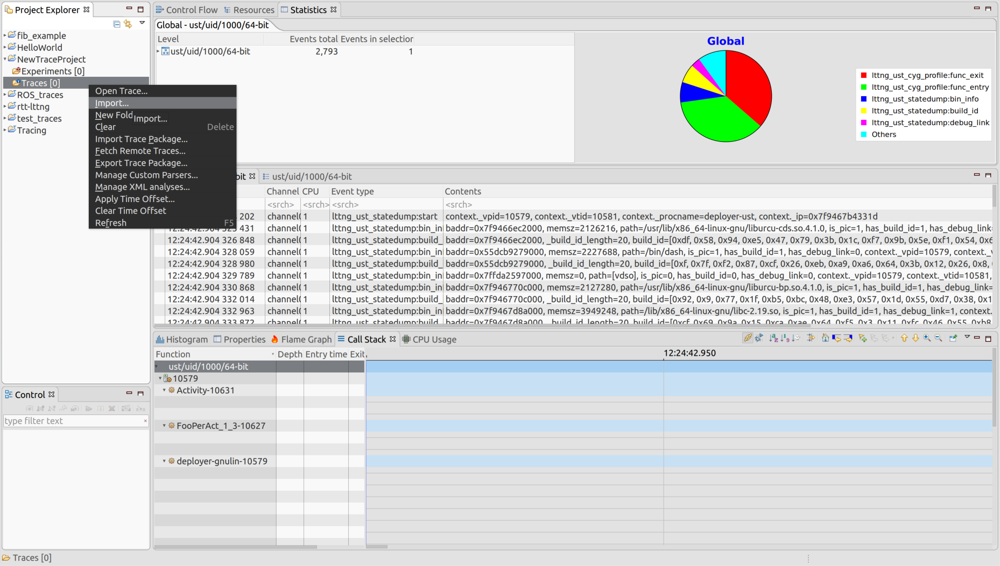
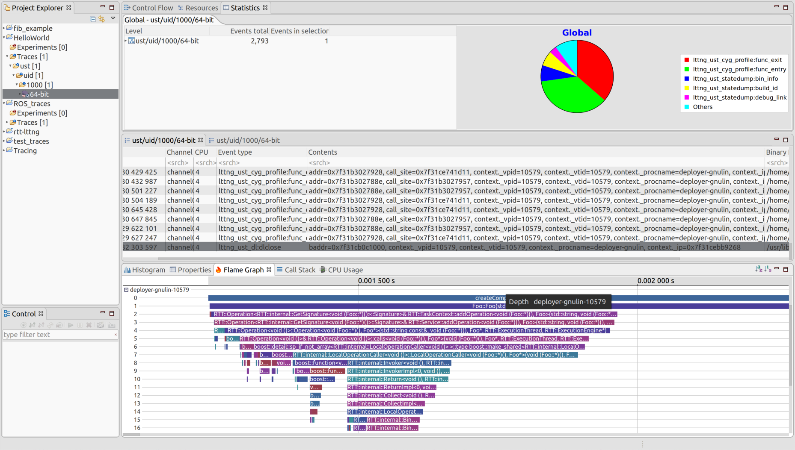

# Orocos Performance Analysis using LTTng

Introduction
------------
This repository will explain the steps to tracing Orocos components using LTTng and visualizing those traces using Trace Compass. 

Be sure to have the following installed:
- [LTTng](http://www.lttng.org/)(>=2.8)
- [Trace Compass](http://tracecompass.org/)
- [Orocos Toolchain](http://www.orocos.org/wiki/upgrading-toolchain-2x-toolchain-28x)
- [Orocos RTT](http://www.orocos.org/stable/documentation/rtt/v2.x/doc-xml/orocos-installation.html)

Also follow these guides to better understand all tools involved:
- [LTTng Docs](http://www.lttng.org/docs/v2.9/)
- [LTTng Function Tracing](http://lttng.org/man/3/lttng-ust-cyg-profile/v2.9/)
- [The Orocos Component Builder's Manual](https://people.mech.kuleuven.be/~orocos/pub/devel/documentation/rtt/master/doc-xml/orocos-components-manual.html)
- [Trace Compass User Guide](http://archive.eclipse.org/tracecompass/doc/stable/org.eclipse.tracecompass.doc.user/User-Guide.html)
- [Trace Compass LTTng-UST analysis](http://archive.eclipse.org/tracecompass/doc/stable/org.eclipse.tracecompass.doc.user/LTTng-UST-Analyses.html)

Tracing Procedure
-----------------
The following are the steps from creating an Orocos component, tracing that component, and visualizing those traces in Trace Compass. 
The steps are included in the compile_component.sh and trace.sh scripts which will compile and begin tracing your component. They have been included in the example HelloWorld component.

1. Create and compile Orocos component with debug flags:
```
- Creating a component is not included in compile_component.sh
orocreate-pkg HelloWorld component
mkdir build; cd build
- Compiler flags can be added to CMakeLists instead of in terminal: set(DCMAKE_CXX_FLAGS "-g -finstrument-functions ${CMAKE_CXX_FLAGS}")
cmake .. -DCMAKE_INSTALL_PREFIX=$(pwd)/../../install -DCMAKE_CXX_FLAGS="-g -finstrument-functions"
make install
cd ..
export RTT_COMPONENT_PATH=$(pwd)/../install/lib/orocos:$RTT_COMPONENT_PATH
```

2. Start LTTng tracing:
```
- Save traces in /out/ directory
lttng create demo_session -o ./out
- Enable all userspace traces
lttng enable-event -u -a
lttng add-context -u -t vpid -t vtid -t procname -t ip
lttng start
- start.ops is the components deployment script
LD_PRELOAD=liblttng-ust-cyg-profile.so:liblttng-ust-dl.so deployer -s start.ops
lttng stop
lttng destroy
```
3. Save Traces:
```
- Save traces to text file
babeltrace ./out/ > trace_data.txt
```
Trace Compass
-------------
1. Open Trace Compass and create a new Tracing project

2. Import the location of the traces

3. Read the Trace Compass User guide on the available views for your trace. Examples:
   
   Flame Graph

   

   Call Stack

   

Alternative Applications
-----------------------
Along with Orocos components, ROS nodes also work very well with LTTng tracing and visualization. 
1. Compile workspace with "-g -finstrument-functions" flags
```
- Insert in CMakeLists 
set(DCMAKE_CXX_FLAGS "-g -finstrument-functions ${CMAKE_CXX_FLAGS}")
- Or in terminal to apply to all packages in workspace
catkin_make --cmake-args -g -finstrument-functions
```
